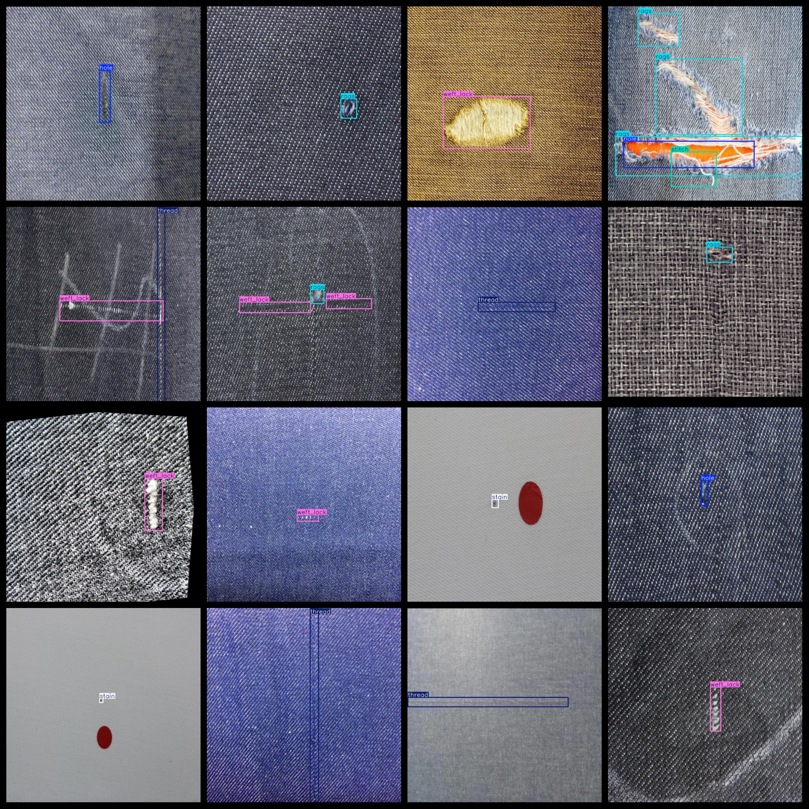
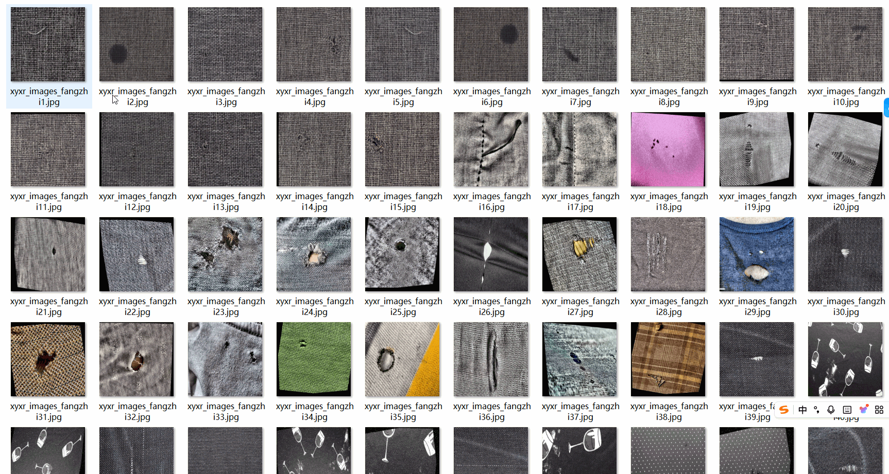

# [Object Detection] Fabric Defect Dataset 1251 imagesYOLO+VOC format

[Target Detection] Fabric Defect Dataset 1251 Images in YOLO+VOC Format

Dataset Format: VOC format + YOLO format

Compressed within the package include: 3 directories, each storing images, xml, and txt files.

The JPEGImages folder contains a total of 1251 jpg images.

The Annotations folder contains a total of 1251 xml files.

The labels folder contains a total of 1251 txt files.

Number of label categories: 6

Label names: ["hole", "rags", "stain", "stitch", "thread", "weft_lack"]

Label names: ["Dong", "PuBao", "ZhiYi", "ZhenJiao", "Xian", "WeiXian"]

Each label's number of bounding boxes (note that the order of categories in the YOLO format does not correspond to this, but is based on the classes.txt in the Labels folder):

hole bounding boxes = 443

rags bounding boxes = 331

stain bounding boxes = 391

stitch bounding boxes = 486

thread bounding boxes = 315

weft_lack bounding boxes = 484

Total bounding boxes: 2450

Image resolution (pixels): Clear

Is image enhanced: No

Shape of labels: Rectangular boxes used for target detection recognition

Important Note: No guarantee is made regarding the accuracy or weights of the trained model or any other data provided in this dataset. The dataset only provides accurate and reasonable annotations.

Annotation and Image Conditions are as follows:
## Images

---

Here is a pay link on Stripe (https://buy.stripe.com/3cs8yP7sY87d0vu9AB). Please contact me lonlonago@foxmail.com after funding $89, and I will send you a complete data files, thank you!

